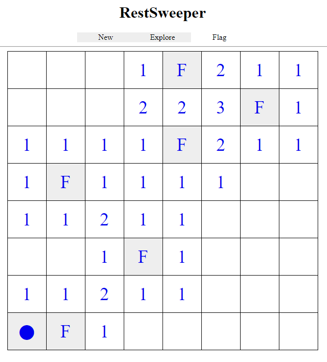

### Restsweeper

Restsweeper is a version of the famous minesweeper game written in php that is totally REST. No session is kept by the server and the game develops sending all the state information through http parameters.

As a proof-of-concept it has been designed and developed with simplicity in mind so the size of the minefield is not programmable nor its difficulty, i.e. the number of hidden mines.

The minefield is square featuring 8 rows and 8 columns and 15% of its 64 cells is filled randomly with mines.

Besides the source code, the executable code can be seen in action here [Restsweeper](http://www.fjmessgeraete.ch/fc225976-8977-4b3f-867e-fd0f7c0593e3/MinefieldHtmlGenerator.php)

## Rules and minefield

Initially the minefield is totally covered therefore the position of mines is unknown.
The purpose of the game is that of discovering all the mines without exploring a cell containing it.

The initial minefield is as shown.

Besides the title, the toolbar contains three tools

1. New to start a new game
2. Explore: when selected, the game is in explore mode, i.e. every click discovers the corresponding cell
3. Flag: when selected, the game is in flag mode, i.e. very click signalizes the cell as flagged, meaning that thee playeer thinks that there is a mine.

In the initial state, the minefield is still not defined.
Clicking in explore mode one cell, creates a minefield that has no mine under the cell being clicked, so as to be sure that it is impossible to loose the game at the very first action.

After the first click, the minefield becomes something as follows.

In this case the explored cell is 1. This means that there is one mine in the eight cells around the explored one. We just try to explore one of them, hoping not to find a mine.

After clicking all these cells, this is what happens.

We have explored one more cell that have one mine in its direct neighbourhood so we still have to test at random. Clicking in explore mode on one adjacent cells becomes as follows

One more one, still we have to explore randomly.

Exploring cell (5,6) is unlucky: a mine is found therefore all the mniefield is shown.
The game is over.

In another game, this configuration gives an interesting hint.
Cell (4,2) is 1 and all the adjacent cells have already been explored. Therefore the only one still unexplored must containg a mine. Moreover the vertically adjacent cells hold 2 and all other cells have been explored, so we are sure that cells (3,3) and (3,4) must contain a mine, therefore we select the flag state above and we click on them: an F (meaning flagged) appears on the aforementioned cells.

In the following game session, almost all the mines have been flagged and only one cell (1,8) is still to be explored.

Clicking on it means that the player has won the game and this is signalled by the WON string above the title.

 

## Implementation details.

When the main php file named `MinefieldHtmlGenerator.php` is accessed, an new void minefield is generated and returned to the client.

This dynamic html file basically contains a table that shows the current status of the game, and each cell features an url that has the following commands.

|parameter|type|description|
|:--------|:---|:----------|
|phase|enum| Enumerates the phases of the game 0 means initial state, 1 means game initialized, minefield void 2 means minefield initialized 3 is the normal state |
|mines|hex string| 64 bits hex coded that represent a bitmap where each bit set is a mine |
|flaged|hex string| 64 bits hex coded that represent a bitmap where each bit set is a flagged cell |
|uncovered|hex string| 64 bits hex coded that represent a bitmap where each bit set is an uncovered cell |
|click|string| 1  character that describes the click: F means flag, E means explore |
|action| string | character string having the format XYS. The coorinates requesting the action has (X,Y) coordinates, each of which is a hex digit from 0 to 7 and S is the state that may be 1 (for clicked) or 2 (for flagged). |

### Hex coded bitmap.

The state of the minefield is encoded by means of three bitmaps that are encoded in hex.

Suppose the bitmap is as follows

| |0|1|2|3|4|5|6|7| Hex |
|:-|:-|:-|:-|:-|:-|:-|:-|:-|-:|
|0|0|0|0|1|0|0|0|0|10|
|1|0|1|1|0|0|0|0|0|B0|
|2|0|0|0|1|0|0|0|0|10|
|3|0|0|0|1|0|0|0|0|10|
|4|0|0|0|0|0|0|0|0|00|
|5|0|0|1|0|0|1|0|0|24|
|6|0|0|0|0|1|1|1|0|0E|
|7|0|0|0|0|1|0|0|0|08|

Then it will be represented with the 16 hex characters string "10B0101000240E08"

